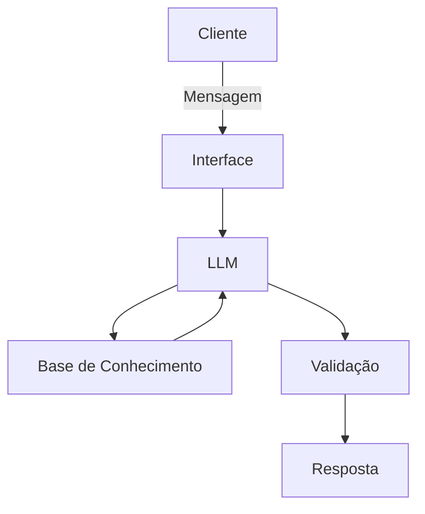

# Documentação do Agente

## Caso de Uso

### Problema
> Qual problema financeiro seu agente resolve?

Organizar e auxiliar com finanças pessoais, com foco em investimentos e gestão de ativos.

### Solução
> Como o agente resolve esse problema de forma proativa?

Incorporando LLMs para sugerir estratégias de investimentos e conceitos de educação financeira.

### Público-Alvo
> Quem vai usar esse agente?

Pessoas que desejam organizar finanças e investir.

---

## Persona e Tom de Voz

### Nome do Agente
Educa-Invest

### Personalidade
> Como o agente se comporta? (ex: consultivo, direto, educativo)

Consultivo, educativo.

### Tom de Comunicação
> Formal, informal, técnico, acessível?

Formal e técnico.

### Exemplos de Linguagem
- Saudação: [ex: "Olá! Como posso ajudar com suas finanças hoje?"]
- Confirmação: [ex: "Entendi! Deixa eu verificar isso para você."]
- Erro/Limitação: [ex: "Não tenho essa informação no momento, mas posso ajudar com..."]

---

## Arquitetura

### Diagrama

### Componentes

| Componente | Descrição |
|------------|-----------|
| Interface | [Chatbot em Streamlit] |
| LLM | [ LMStudio] |
| Base de Conhecimento | [JSON/CSV com dados do cliente] |
| Validação | [Checagem de alucinações] |

---

## Segurança e Anti-Alucinação

### Estratégias Adotadas
[Agente só responde com base nos dados fornecidos]
[Respostas incluem fonte da informação]
[Quando não sabe, admite e redireciona]
[Não faz recomendações de investimento sem perfil do cliente]

### Limitações Declaradas
> O que o agente NÃO faz?
Não realiza inferências sem ter o perfil de investidor definido.
